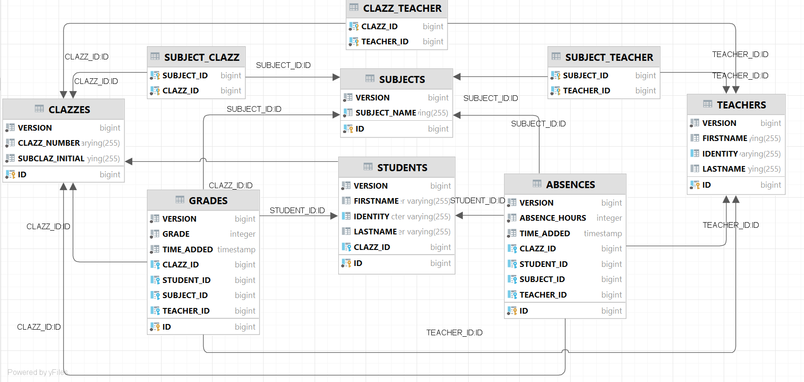

#  School Diary - ActiveRecord Multy ManyToMany relations

##  Description  
* School Diary project with ActiveRecord of Panache implemented.  
* Folders organized per object, i.e. object Student has a folder student with all the layers like  StudentResource, StudentDTO, etc.  
* Implemented without Service layer!!!  
* Used ManyToMany bidirectional relations implemented with Set<...>  in the relational database.

## Schema

## RestAssured integration testing:
We should remove the (@Observes StartupEvent ev) from the initSomeData method in the DataLoader class, before starting the tests

## Project constraints:
Currently, there are 2 project constraints:  
* One student can **not** move from one class to another (i.e. from klas 3A into klas 3B for example).  
  
* Possibility for undesired assignments:
  * teachers t1 and t2 teach for example the following subjects: biol, music and history.  
  * teachers t1 and t2 teach in klas 6A.  
  * I.e. klas 6A is being taught on biol, music and history.  
  * Let's take a look on this scenario: teacher t1 is allowed to teach biol and music in 6A, and teacher t2 is only allowed to teach history in 6A.  
  * The problem is that we have not explicitly defined that teachers can change the subjects taught in klas 6A - and when we make a check about the marks teachers assessed students with, it would be possible teacher t2 to put marks not only on subject history (allowed), but also on subjects biol and music (not allowed). 
  * Therefore, we can create one more table Assignments with 3 keys (ManyToOne relations to Clazz, Subject and Teacher) - as done in the previous project **Schooldiary Project - ActiveRecord ManyToOne relations** 

## Plan for endpoints:
* I) Clazz
method createClazz  
post url: /clazz – adding/creating a new klas  
input json body: {clazzNumber, subclazzInitial}  
output json body: not needed, we just return status 201 Created  

method getAllClazzes
get url: /clazz - return all school klasses  
input json body: no  
output json body: Array of {clazzId, clazzNumber, subclazzInitial} objects  

method getClazzByName  
get url: /clazz/name/{clazzName} – from 1A path param, we return data about klas 1A
input json body: няма  
output json body: {clazzId, clazzNumber, subclazzInitial}  

method addStudentToClazz  
patch url: /clazz/{clazzId}/student?studentId={studentId} – add student to a klas
input json body: no  
output json body: not needed, we just return status 204 No content  

method getClazzesByTeacher
get url: /clazz/teacher/{teacherId} – takes all klasses a given teacher teaches to  
input json body: no  
output json body: Array of {clazzId, clazzNumber, subclazzInitial} objects  

method assignSubjectToClazzAllowed  
patch url: /clazz/{clazzId}/allowedsubjects?subjectId={subjectId} – defines what subject a klas is allowed to be taught on  
input json body: no  
output json body: not needed, we just return status 204 No content

method assignTeacherToClazzAndSubject  
patch url: /clazz/{clazzId}/assign?teacherId={teacherId}&subjectId={subjectId} – assigns a teacher to a klas only if klas is allowed to be taught that subject  
input json body: no  
output json body: not needed, we just return status 204 No content

* II) Student
method createStudent  
post url: /student – create/add a new student  
input json body: {firstName, lastName, identity}  
output json body: no, but we return status 201 Created  

method getAllStudents  
get url: /student – returns all students  
input json body: no  
output json body: Array of {studentId, firstName, lastName, identity, clazz} objects 
When a student do not belong to any klas yet, then clazz is null and JSON-B does not show it  

method getStudentByIdentity  
get url: /student/identity/{identity} – returns a student by identity  
input json body: няма  
output json body: {studentId, firstName, lastName, identity, clazz}  
When a student do not belong to any klas yet, then clazz is null and JSON-B does not show it 

* III) Teacher 
method createTeacher  
post url: /teacher - creates a new teacher in the school  
input json body: {firstName, lastName, identity}  
output json body: no, we return status 201 Created  

method getAllTeachers  
get url: /teacher – returns all teachers from that school  
input json body: no  
output json body: Array of {teacherId, firstName, lastName, identity} objects

method getTeacherByIdentity  
get url: /teacher/identity/{identity} – returns a teacher by identity
input json body: no
output json body: {teacherId, firstName, lastName, identity}  

method getClazzesOfATeacher  
get url: /teacher/{teacherId}/klazzes – returns all klasses that teacher teaches  
input json body: no  
output json body: Array of {clazzId, clazzNumber, subclazzInitial} objects 

method getSubjectsOfATeacher  
get url: /teacher/{teacherId}/subjects – returns all subjects a teacher teaches at  
input json body: no  
output json body: Array of {subjectId, name} objects

method getClazzesByTeacherAndSubject  
get url: /teacher/{teacherId}/clazzes/{subjectId} – returns all klasses a teacher teaches at on a specific subject  
input json body: no
output json body: Array of {klasId, klasNumber, klasLetter} objects

method getSubjectsByTeacherAndClazz  
get url: /teacher/{teacherId}/subjects/{clazzId} – return all subjects a teacher teaches at a given klas  
input json body: no
output json body: Array of {subjectId, name} objects

* IV) Subject
method createSubject  
post url: /subject – creates a new school subject  
input json body: {name}  
output json body: no, we return status 201 Created  

method getAllSubjects  
get url: /subject – returns all school subjects  
input json body: no
output json body: Array of {subjectId, name} objects  

method getSubjectByName  
get url: /subject/name/{name} – търси по име и връща конкретен учебен предмет  
input json body: no
output json body: {subjectId, name}  

* V) Grade
method teacherWritesGradePerStudentPerSubject
post url: /grade?studentId={studentId}&subjectId={subjectId}&teacherId={teacherId} – create a grade record - about a teacher putting a grade to a student on a school subject  
input json body: {grade}  
output json body: {gradeId, grade, timeAdded, teacherFullName} body together with response status 201 Created and URL of the created grade

method getAllGradesPerStudentPerSubject
get url: /grade?studentId={studentId}&subjectId={subjectId} – returns all grades (sorted ascending by timeAdded) of a student on a subject (possibility different teachers to have put the grades if several teachers teach in that klas for one and the same relevant subject)  
input json body: no  
output json body: Array of {gradeId, grade, timeAdded, teacherFullName} objects  

* VI) Absence
method teacherWritesAbsencePerStudentPerSubject
post url: /absence?studentId={studentId}&subjectId={subjectId}&teacherId={teacherId} – it creates record for absence mark a teacher put for a student on a school subject  
input json body: {absenceHours}  
output json body: {absenceId, absenceHours, timeAdded, teacherFullName} body together with response status 201 Created and URL of the created grade

method getAllAbsenceRecordsPerStudentPerSubject
get url: /absence?studentId={studentId}&subjectId={subjectId} - returns all absence marks of a student on a subject (possibility different teachers to have put the absence marks if several teachers teach in that klas for one and the same relevant subject)  
input json body: no  
output json body: Array of {absenceId, absenceHours, timeAdded, teacherFullName} objects
