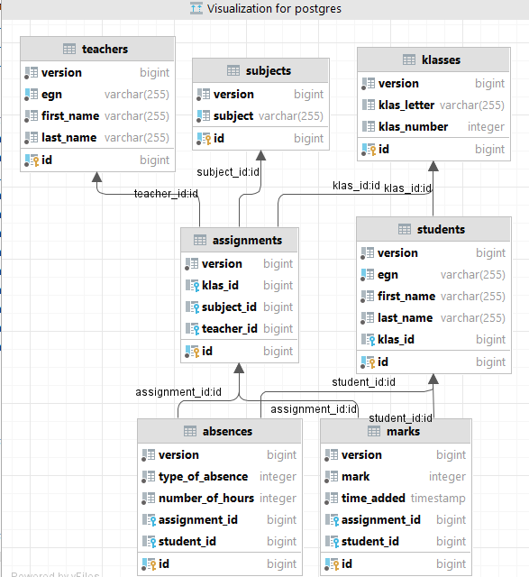

# Schooldiary Project - ActiveRecord ManyToOne relations

## Description  
* SchoolDiary project with ActiveRecord of Panache implemented.  
* Folders organized per object, i.e. object Student has a folder student with all the layers like  StudentService, StudentRestResource, StudentMapStruct, StudentDto, etc.  
* Implemented with Service layer in each folder.  
* Used only ManyToOne relations in the relational database.

## Schema
Using only Many-To-One relation

## DB connection
* In case you use PostgreSQL, first you need to create manually the db database `schooldiary` (for example with the help of PGAdmin 4).
* Then you run the command: `mvn clean quarkus:dev` 

## Testing
* Using embedded h2 db (h2 test db is stored at ./tests_h2 folder)
* All the tests can be run altogether with the terminal command: mvn test (`mvn clean quarkus:test`). Make sure you have appropriate version Maven and Java installed. 
* Except the tests for  StudentService.java and StudentRestResource.java - they are made only with the TestOrdererMethod and without the @BeforeEach and @AfterEach annotated methods. You can run the tests for StudentService.java and StudentRestResource.java manually.
* Also, we should remove the @PostConstruct annotation for starting the tests

## Project constraints:
* One student can **not** move from one class to another (i.e. from klas 3A into klas 3B for example).

## A plan for the endpoints:

I) Klas
method getAllKlasses
get url: /klas – returns all klasses  
input json body: no  
output json body: Array of {klasId, klasLetter, klasNumber} objects  

method getKlassById
get url: /klas/{id} – returns info about the relevant klas  
input json body: no  
output json body: {klasId, klasLetter, klasNumber}  

method addNewKlas
post url: /klas – creates a new klas in the school  
input json body: {klasLetter, klasNumber}         
output json body: {klasId, klasLetter, klasNumber}  

method getAllKlasStudentsByKlasId
get url: /klas/{id}/students – returns all students from a klas  
input json body: no
output json body: Array of {studentId, firstName, lastName, egn, klasId, klasName} objects

method getAllKlasTeachersByKlasId
get url: /klas/{id}/teachers – returns all teachers teaching in this klas  
input json body: no  
output json body: Array of {teacherId, firstName, lastName, egn} objects

method assignKlasAStudent
patch url: /klas/{klasId}/student/{studentId} – sets the student to be in that klas 
input json body: no  
output json body: {studentId, firstName, lastName, egn, klasId, klasName}

II) Student
method getAllStudents
get url: /student – връща всички студенти  
input json body: no
output json body: Array of {studentId, firstName, lastName, egn, klasId, klasName} objects
When a student is not yet set to be part of any klas, then klasId and klasName are null and JSON-B do not show them in the result. 

method getStudentById
get url: /student/{studentId} – returns a student by studentId  
input json body: no  
output json body: {studentId, firstName, lastName, egn, klasId, klasName}  
When a student is not yet set to be part of any klas, then klasId and klasName are null and JSON-B do not show them in the result. B  

method addNewStudent
post url: /student – creates a new student  
input json body: {firstName, lastName, egn}       
output json body: Array of {studentId, firstName, lastName, egn} objects  

method assignStudentToKlas
patch url: /student/{studentId}/klas/{klasId} – sets the student to be in that klas
input json body: no
output json body: {studentId, firstName, lastName, egn, klasId, klasName}  

III) Subject
method getAllSubjects
get url: /subject – returns all school subjects  
input json body: no
output json body: Array of {subjectId, subject string} objects  

method getSubjectById
get url: /subject/{subjectId} – returns a concrete school subject  
input json body: no
output json body: {subjectId, subject string}  

method addNewSubject
post url: /subject – creates a new school subject  
input json body: {subject string}  
output json body: Array of {subjectId, subject string} objects  

IV) Teacher
method getAllTeachers
get url: /teacher – returns all teachers  
input json body: no
output json body: Array of {teacherId, firstName, lastName, egn} objects

method getTeacherById
get url: /teacher/{teacherId} – return teacher by id 
input json body: no  
output json body: {teacherId, firstName, lastName, egn}  

method addNewTeacher
post url: /teacher – creates a new teacher  
input json body: {firstName, lastName, egn}     
output json body: Array of {teacherId, firstName, lastName, egn} objects

method getKlassesByTeacherId
get url: /teacher/{teacherId}/klasses – return all klasses that teacher teaches at  
input json body: no
output json body: Array of {klasId, klasNumber, klasLetter} objects 

method getSubjectsByTeacherId
get url: /teacher/{teacherId}/subjects – return all school subjects that teacher teaches at   
input json body: no       
output json body: Array of {subjectId, subject string} objects  

method getKlassesByTeacherIdAndSubjectId
get url: /teacher/{teacherId}/{subjectId}/klasses – returns all klasses that teacher teaches at on a specific school subject 
input json body: no     
output json body: Array of {klasId, klasNumber, klasLetter} objects

method getSubjectsByTeacherIdAndKlasId
get url: /teacher/{teacherId}/{klasId}/subjects – returns all school subjects that teacher teaches at that klas  
input json body: no  
output json body: Array of {subjectId, subject string} objects

V) Assignment
method assignSubjectAndKlasPerTeacher
post url: /teacher – assigns a teacher to teach in that klas on that school subject  
input json body: {teacherId, subjectId, klasId}  
output json body: {assignmentId, teacherId, firstName, lastName, egn}  

VI) Mark
method getAllMarksPerStudentPerSubject
get url: /mark/{studentId}/{subjectId} – returns all student's marks per subject for a student (sorted ascending by timeAdded) - may have marks on same subject from different teachers  
input json body: no     
output json body: Array of {markId, mark int, timeAdded, teacherId, teacherFullName} objects  

method teacherWriteMarkPerStudentPerSubject
post url: /mark/{studentId}/{subjectId} – create a record about a new mark the relevant teacher put for that student on that subject  
input json body: {mark int, teacherId}  
output json body: {markId, mark int, timeAdded, teacherId, teacherFullName}  

VII) Absence
method getAllAbsencesPerStudentPerSubject
get url: /absence/{studentId}/{subjectId} – returns all student's absences per subject for a student (sorted ascending by timeAdded) - may have absences on same subject from different teachers  
input json body: no  
output json body: Array of {absenceId, absenceType, countHours, timeAdded, teacherId, teacherFullName} objects

method teacherWriteAbsencePerStudentPerSubject
post url: /mark/{studentId}/{subjectId} – прави запис за поставяне на отсъствие - от учител на ученик по даден предмет  
input json body: {countHours, absenceType, teacherId}  
output json body: {absenceId, absenceType, countHours, timeAdded, teacherId, teacherFullName}
